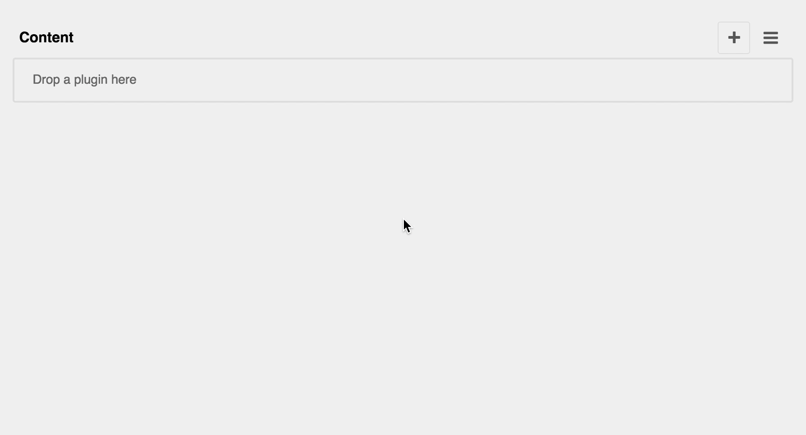

================
django CMS Audio
================

|pypi| |build| |coverage|

**django CMS Audio** is a set of plugins for `django CMS <http://django-cms.org>`_
that allow you to publish audio files on your site (using an HTML5 player by default,
but you can override this in your own templates if required).

It uses files managed by `Django Filer <https://github.com/divio/django-filer>`_.
The plugins allow you to select a single file or an entire folder of files.

.. note:: 

    This project is considered 3rd party (no supervision by the `django CMS Association <https://www.django-cms.org/en/about-us/>`_). Join us on `Slack                 <https://www.django-cms.org/slack/>`_ for more information.

*******************************************
Contribute to this project and win rewards
*******************************************

Because this is a an open-source project, we welcome everyone to
`get involved in the project <https://www.django-cms.org/en/contribute/>`_ and
`receive a reward <https://www.django-cms.org/en/bounty-program/>`_ for their contribution. 
Become part of a fantastic community and help us make django CMS the best CMS in the world.   

We'll be delighted to receive your
feedback in the form of issues and pull requests. Before submitting your
pull request, please review our `contribution guidelines
<http://docs.django-cms.org/en/latest/contributing/index.html>`_.

We're grateful to all contributors who have helped create and maintain this package.
Contributors are listed at the `contributors <https://github.com/django-cms/djangocms-audio/graphs/contributors>`_
section.

Documentation
=============

See ``REQUIREMENTS`` in the `setup.py <https://github.com/divio/djangocms-audio/blob/master/setup.py>`_
file for additional dependencies:

|python| |django| |djangocms|

* Django Filer 1.7 or higher

Make sure `django-filer <http://django-filer.readthedocs.io/en/latest/installation.html>`_
is installed and configured appropriately.

Installation
------------

For a manual install:

* run ``pip install djangocms-audio``
* add ``djangocms_audio`` to your ``INSTALLED_APPS``
* run ``python manage.py migrate djangocms_audio``

Configuration
-------------

Note that the provided templates are very minimal by design. You are encouraged
to adapt and override them to your project's requirements.

This addon provides a ``default`` template for all instances. You can provide
additional template choices by adding a ``DJANGOCMS_AUDIO_TEMPLATES``
setting::

    DJANGOCMS_AUDIO_TEMPLATES = [
        ('feature', _('Featured Version')),
    ]

You'll need to create the `feature` folder inside ``templates/djangocms_audio/``
otherwise you will get a *template does not exist* error. You can do this by
copying the ``default`` folder inside that directory and renaming it to
``feature``.

``MP3`` and ``OGG`` files are allowed by default. We recommend using ``MP3``
as it's supported across all major browsers. You can change the default
setting by overriding::

    DJANGOCMS_AUDIO_ALLOWED_EXTENSIONS = ['mp3', 'ogg', 'wav']

Running Tests
-------------

You can run tests by executing::

    virtualenv env
    source env/bin/activate
    pip install -r tests/requirements.txt
    python setup.py test

.. |pypi| image:: https://badge.fury.io/py/djangocms-audio.svg
    :target: http://badge.fury.io/py/djangocms-audio
.. |build| image:: https://travis-ci.org/divio/djangocms-audio.svg?branch=master
    :target: https://travis-ci.org/divio/djangocms-audio
.. |coverage| image:: https://codecov.io/gh/divio/djangocms-audio/branch/master/graph/badge.svg
    :target: https://codecov.io/gh/divio/djangocms-audio

.. |python| image:: https://img.shields.io/badge/python-3.5+-blue.svg
    :target: https://pypi.org/project/djangocms-audio/
.. |django| image:: https://img.shields.io/badge/django-2.2,%203.0,%203.1-blue.svg
    :target: https://www.djangoproject.com/
.. |djangocms| image:: https://img.shields.io/badge/django%20CMS-3.7%2B-blue.svg
    :target: https://www.django-cms.org/
